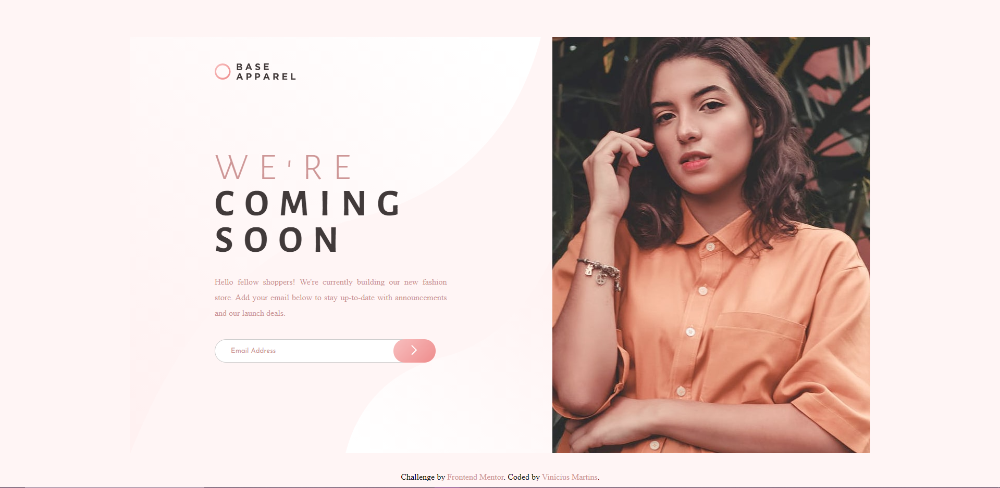
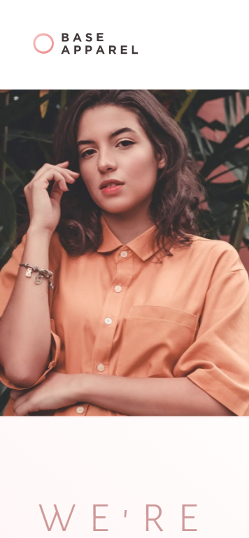
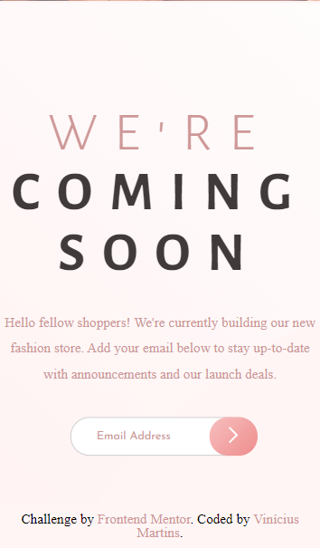

# Frontend Mentor - Base Apparel coming soon page solution

This is a solution to the [Base Apparel coming soon page challenge on Frontend Mentor](https://www.frontendmentor.io/challenges/base-apparel-coming-soon-page-5d46b47f8db8a7063f9331a0). Frontend Mentor challenges help you improve your coding skills by building realistic projects. 

## Table of contents

- [Overview](#overview)
  - [The challenge](#the-challenge)
  - [Screenshot](#screenshot)
  - [Links](#links)
- [My process](#my-process)
  - [Built with](#built-with)
- [Author](#author)

## Overview

### Screenshot

### Links

- Solution URL: [Github](https://www.github.com/ViniciusAlba/Base-Apperal-coming-soon-page)
- Live Site URL: [Netlify](https://www.baseapparelcomingsoonpagevnmartins.netlify.app/)

### Built with

- Semantic HTML5 markup
- CSS custom properties
- CSS Grid

## Author

- Website - [Vinicius Martins](https://www.github.com/ViniciusAlba)
- Frontend Mentor - [@ViniciusAlba](https://www.frontendmentor.io/profile/ViniciusAlba)
- Twitter - [@viniciusnitram](https://www.twitter.com/viniciusnitram)